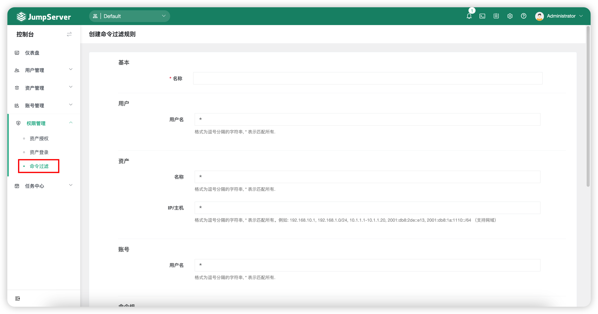
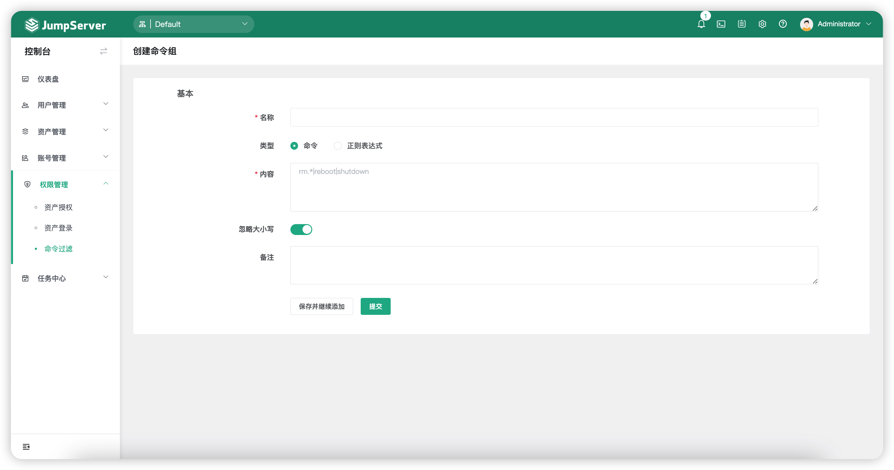

# 命令过滤
## 1 功能简述
!!! tip ""
    - JumpServer 支持对会话过程中使用的命令进行过滤，设置命令过滤规则。
    - 命令过滤器可以绑定 JumpServer 用户、资产、连接资产使用的用户，一个命令过滤可以绑定多个命令组，当绑定的用户用绑定的账号连接绑定的资产执行命令时，这个命令需要被绑定过滤器的所有命令组进行匹配，高优先级先被匹配；当某一条规则被匹配到后，会根据该规则的动作执行，如果没有匹配到对应的规则，命令即正常执行。

## 2 命令过滤的创建
!!! tip ""
    - 该页面可以针对命令过滤器进行创建、删除、更新、查看。
    - 点击`命令过滤`页面的`命令过滤`页签即进入命令过滤器的页面。
    - 点击该页面左上角的`创建`按钮，即可创建命令过滤器。

!!! tip ""
    - 详细参数说明：

!!! tip ""

    | 参数    |                说明                  |
    | ------- | ------------------------------------ |
    | 名称 | 命令过滤器的名称。 |
    | 用户-用户名 | 该命令过滤器匹配的 JumpServer 用户。 |
    | 资产-名称 | 该命令过滤器匹配的资产名称。 |
    | 资产-IP/主机 | 该命令过滤器匹配的资产 IP/主机。 |
    | 账号-用户名 | 该命令过滤器匹配的登录资产的用户名。 |
    | 命令组 | 该命令过滤器关联的命令组，当匹配到的 JumpSerevr 使用匹配到的系统用户登录匹配到的资产执行这些命令时执行相应的动作。 |
    | 动作 | 匹配到该资产登录规则时做出的动作。   A."拒绝"：拒绝登陆资产；  B."接收"：允许登陆资产；  C."审批"：经过设置的审批人审批允许或者拒绝登陆。 |
    | 优先级 | 命令过滤器的优先级，优先级可选范围为1~100，数值越小规则匹配越优先，默认为50。 |

## 3 命令组的创建
!!! tip ""
    - 命令组可以绑定到命令过滤器中，命令组目前支持两种语法，分别是正则表达式和命令。
    - 点击`命令过滤`页面的`命令组`页签即进入命令过滤器的页面。
    - 点击该页面左上角的`创建`按钮，即可创建命令组。

!!! tip ""
    - 详细参数说明：

!!! tip ""

    | 参数    |                说明                  |
    | ------- | ------------------------------------ |
    | 名称 | 命令组的名称。 |
    | 类型 | 正则表达式表示通过正则表达式进行命令匹配，命令则表示过滤某固定命令。 |
    | 内容 | 内容可以是多行文本，每一行代表一条匹配规则。 |
    | 忽略大小写 | 指将填入的命令不论大小写，一律按规则进行筛选。 |