# Web 终端

## 1 功能简述
!!! tip ""
    - Web 终端页面主要用于资产连接。
    - 点击工作台页面的`Web 终端`按钮或者右上角图标，均可跳转到 Web 终端页面，并在跳转后的页面发起资产访问。

## 2 Web 终端快捷跳转
!!! tip ""
    - 快捷跳转按钮如图：

!!! tip ""
    - 跳转后效果如图：
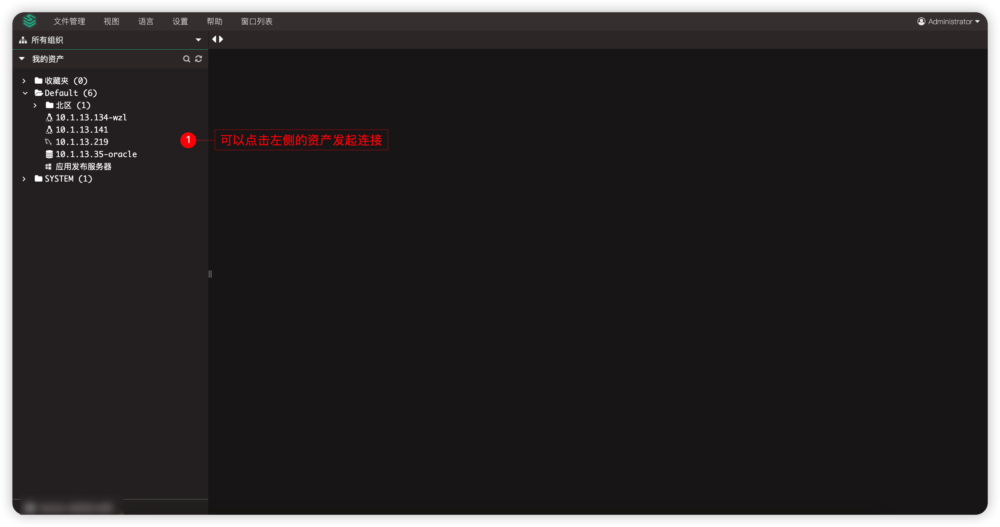

## 3 组织切换
!!! tip ""
    - JumpServer 堡垒机支持在 Web 终端页面按照组织显示授权的资产。
    - 在某一个用户在多组织下都拥有资产授权时，可在如图示中按钮切换组织并获取该组织的授权；在需求连接资产时，可以在左侧资产树列表中选择需要访问的资产，也可以通过资产名称或 IP 进行模糊索索，快速找到访问目标，点击即可登录。
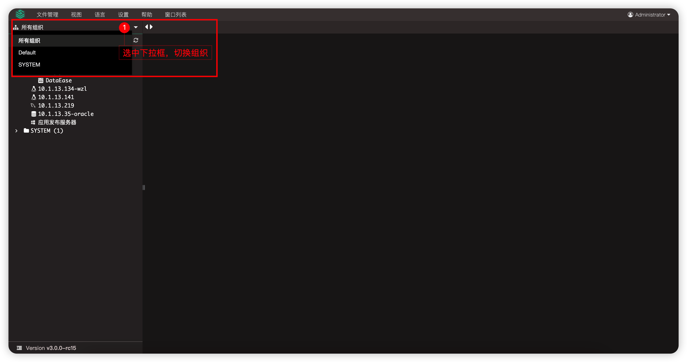

## 4 资产连接
!!! tip ""
    - Web 终端页面主要功能即为资产连接，不同类型的资产支持的连接方式也不同。

### 4.1 Linux 资产连接
!!! tip ""
    - 在 Web 终端页面选中`Linux 资产` - 选择`账号` - 选择`连接方式`后点击`登陆`。
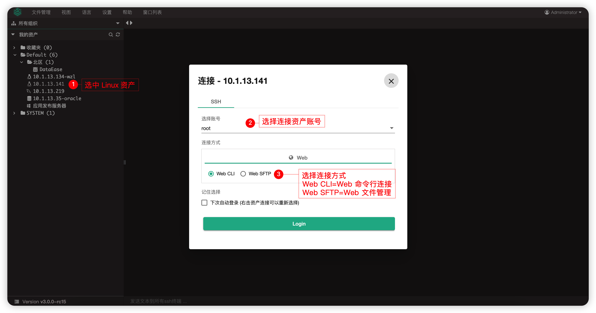

!!! tip ""
    - Web CLI 连接效果如下：
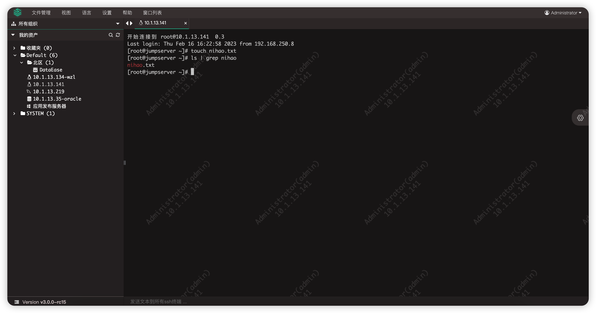

!!! tip ""
    - Web SFTP 连接效果如下：
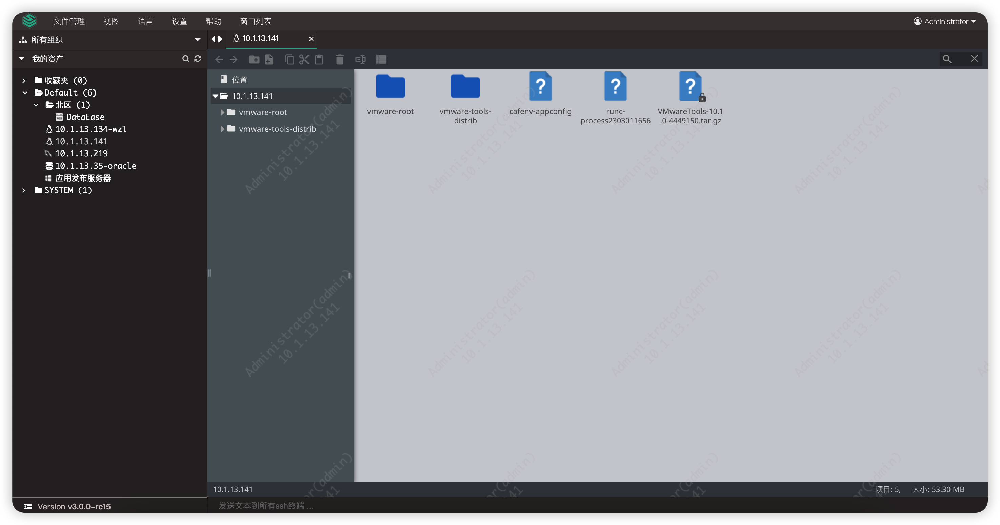

### 4.2 Windows 资产连接
!!! tip ""
    - 在 Web 终端页面选中`Windows 资产` - 选择`账号` - 选择`连接方式`后点击`登陆`。
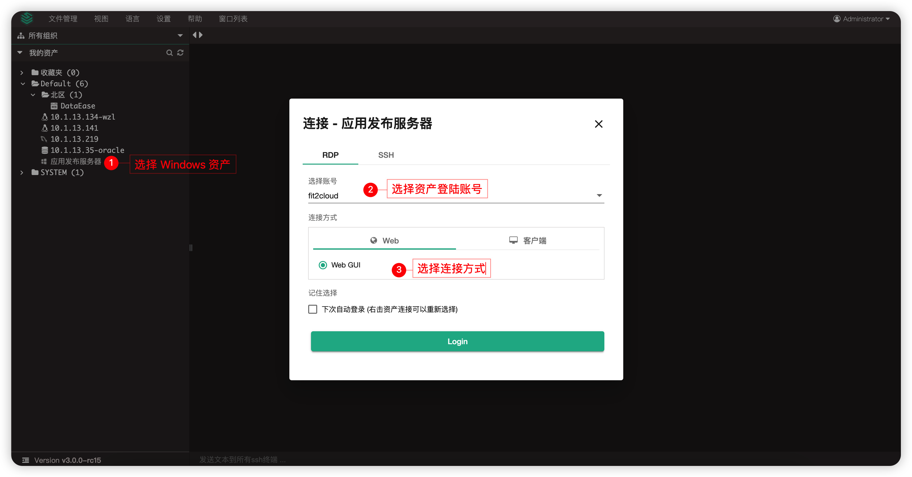

!!! tip ""
    - Web GUI 连接效果如下:
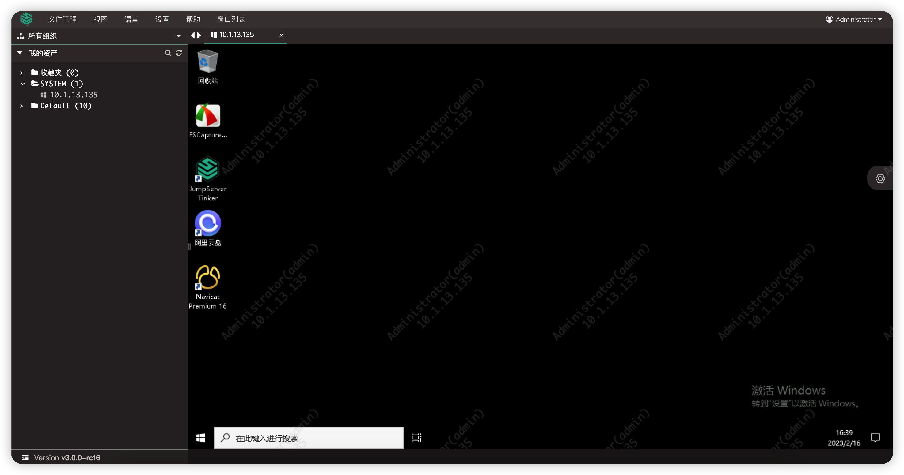

### 4.3 数据库资产连接
!!! tip ""
    - JumpServer 提供多种方式登录数据库，例如命令行的方式 Web CLI，图形化方式 Web GUI，数据库代理直连方式 DB Client，远程应用方式拉起数据库工具后连接。
    
!!! tip ""
    - 以 MySQL 为例。
    - 在 Web 终端页面选中`数据库资产` - 选择`账号` - 选择`连接方式`后点击`登陆`。
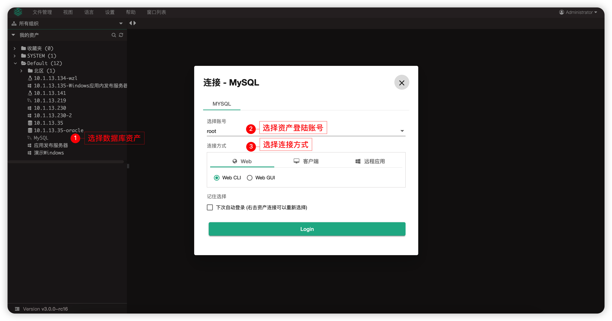

!!! tip ""
    - Web CLI 连接效果如下:

!!! tip ""
    - Web GUI 连接效果如下:

!!! tip ""
    - 数据库类型连接支持说明：

!!! tip "" 

    | 数据库类型\连接方式 | Web CLI | Web GUI | DB Client | 远程应用方式 |
    | -------| :-------: | :-------: | :-------: | :-------: |
    | MySQL | √ | √ | √ | √ |
    | MariaDB | √ | √ | √ | √ |
    | PostgreSQL | √ | √ | √ | √ |
    | Oracle |  | √ | √ | √ |
    | SQL Server | √ |  |  |  |
    | Redis | √ |  | √ | √ |
    | MongoDB | √ |  |  | √ |
    | ClickHouse | √ |  |  | √ |

## 5 文件管理
!!! tip ""
    - 在 Web 终端页面，点击`文件管理`按钮，选择`连接`按钮即可进入文件管理模块。
    - 具体请查看[文件管理模块具体介绍](file_management.md)
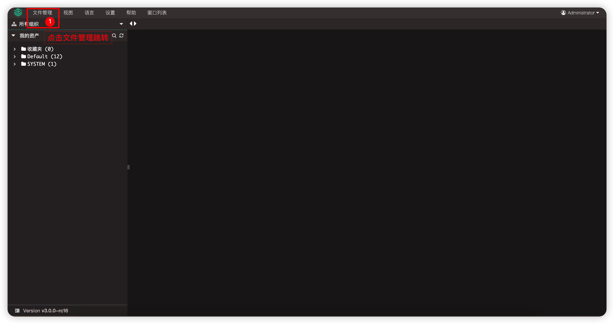

## 6 视图
!!! tip ""
    - `视图`按钮主要用来在连接资产的情况下全屏展示。

## 7 语言
!!! tip ""
    - JumpServer 支持多种语言，包含英语、中文、日语。
    - `语言`按钮可以切换 JumpServer 系统的显示语言。
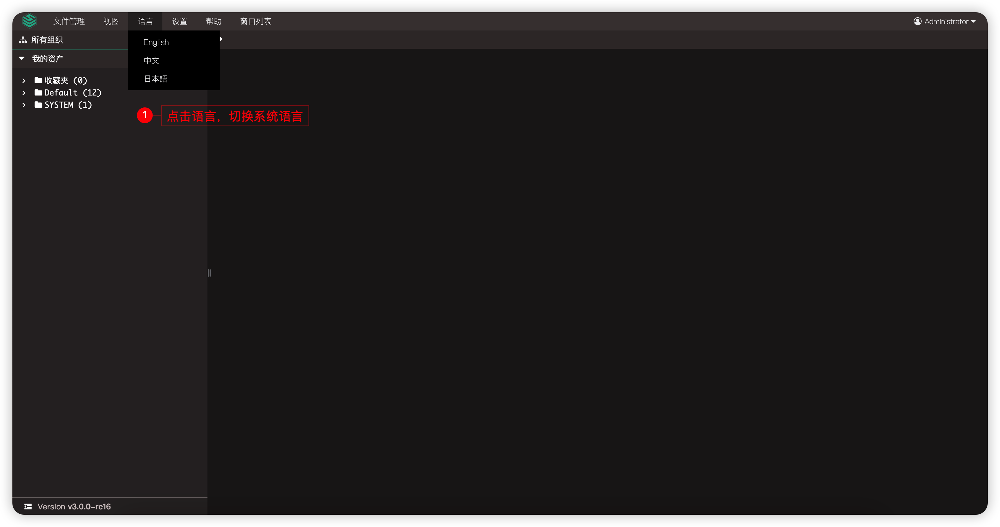

## 8 设置
!!! tip ""
    - `设置`按钮主要针对于 JumpServer资产 连接过程中的设置信息，其中包含：基本配置、图形化、命令行。

### 8.1 基本配置
!!! tip ""
    - 异步加载资产树：资产连接中是否实时加载资产树。

### 8.2 图形化
!!! tip ""
    - RDP分辨率：修改RDP分辨率，默认为Auto。
    - RDP客户端选项：RDP客户端连接是否开启全屏与磁盘挂载。
    - 远程应用连接方式：选择远程应用的连接方式，Web或者客户端方式。

### 8.3 命令行
!!! tip ""
    - 字符终端字体大小：设置终端字体的大小显示。
    - 字符终端Backspace As Ctrl+H：在命令行中是否开启快捷键Ctrl+H做为删除键。
    - 右键快速粘贴：命令行是否开启右键快速粘贴。

### 8.4 页面展示

## 9 帮助
!!! tip ""
    - `帮助`按钮主要分为三个模块，文档、支持、下载三个模块。

!!! tip ""
    - 文档与支持跳转链接均可进行修改，修改按钮位于：`系统设置` - `其它设置` - 导航栏链接模块。
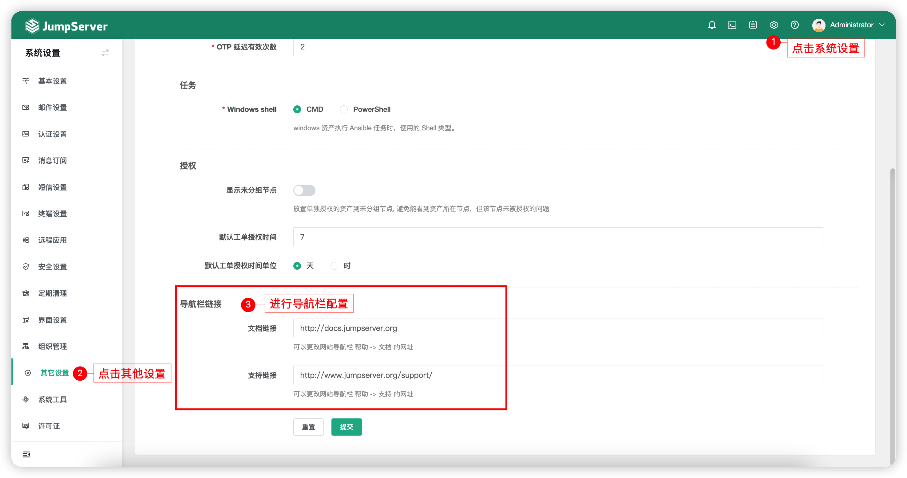

!!! tip ""
    - 下载链接跳转至 JumpServer 系统周边工具下载，包含：JumpServer 客户端、微软 RDP 客户端、JumpServer 离线录像播放器等。
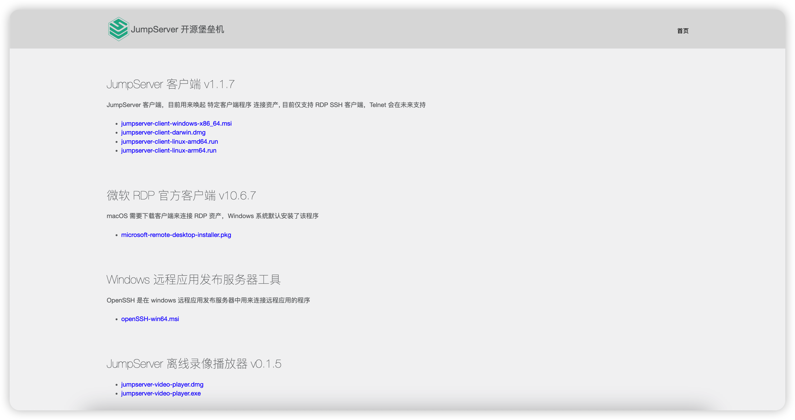
