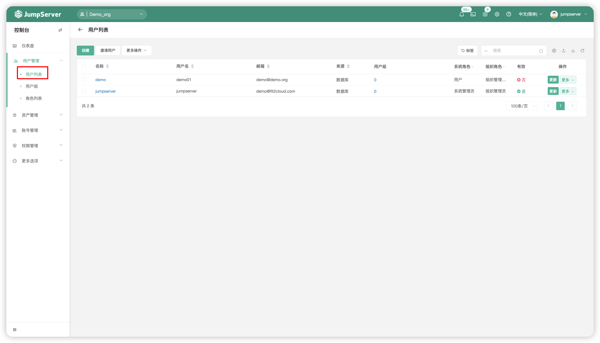
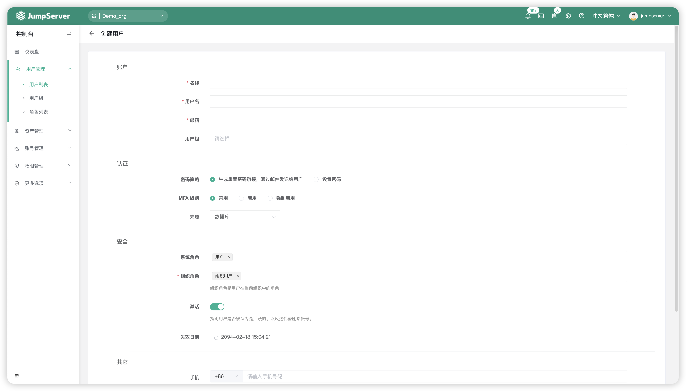
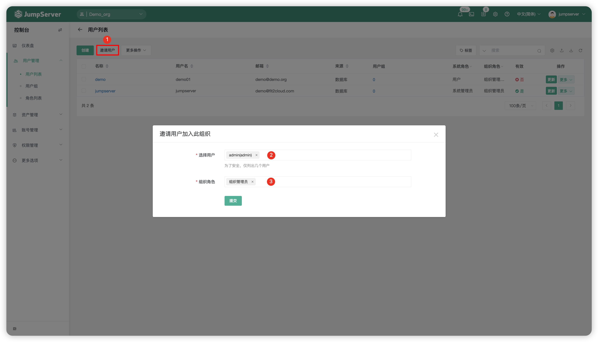
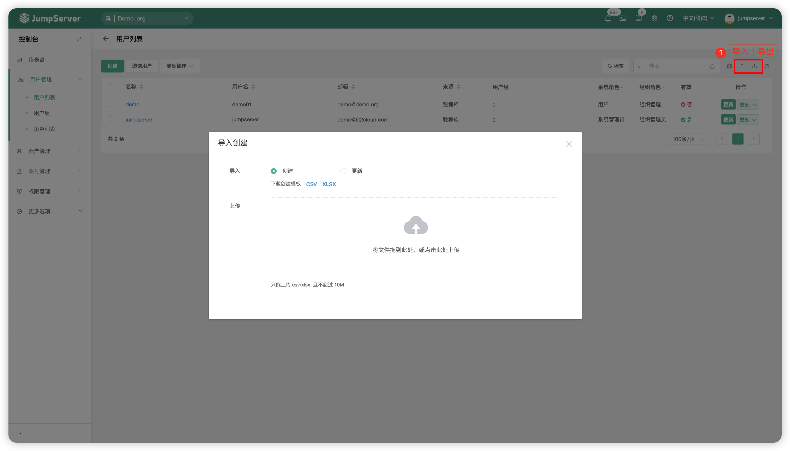
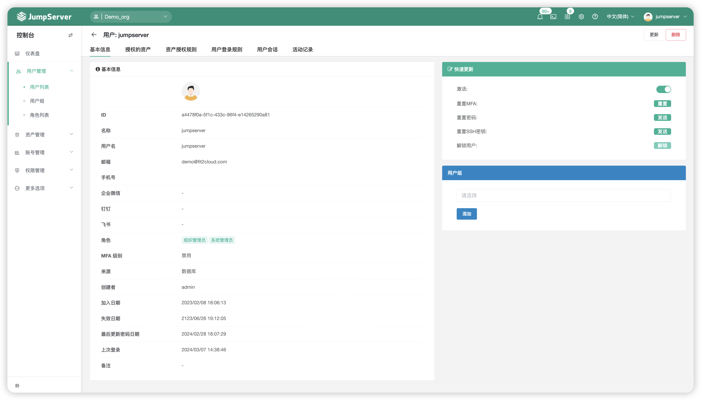
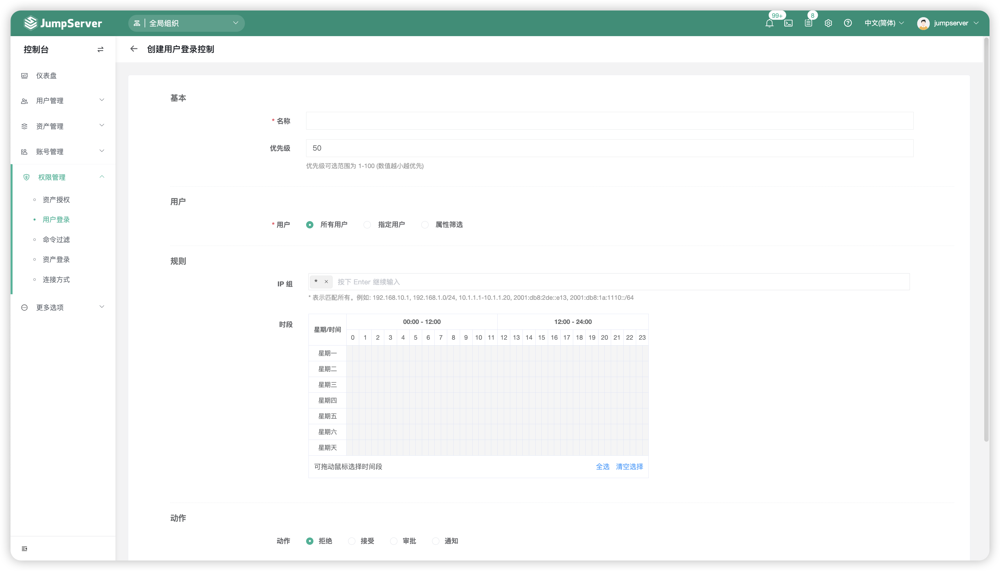
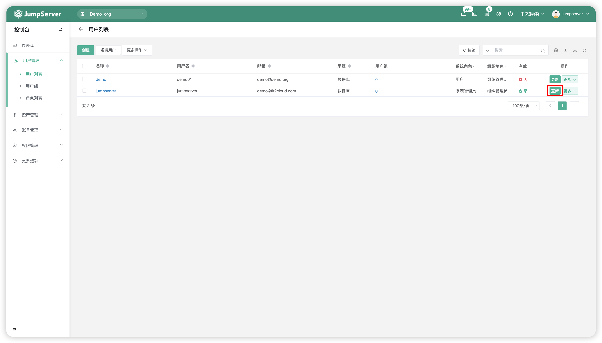

# 用户列表
## 1 功能简述
!!! tip ""
    - 点击`用户管理`-`用户列表`按钮，进入用户列表页面。
    - 该页面主要负责 JumpServer 用户的操作，包含增加、删除、更新、查看等。

## 2 创建用户
!!! tip ""
    - 点击`用户列表`页面的`创建`按钮，进入用户详细创建页面。

!!! tip ""
    - 详细参数说明：

    | 参数    |                说明                  |
    | -------| ------------------------------------ |
    | 名称 | 用户识别名称，可重复。  |
    | 用户名 | 登录 JumpServer 的登录账号，不可重复。 |
    | 邮箱 | 登录账号对应的邮箱地址，不可重复。 |
    | 用户组 | 将用户按组进行管理，主要用于资产授权，当某个资产对某个用户组授权时，这个用户组所有的用户都对这个资产有相应的权限。 |
    | 密码策略 | 密码在管理员创建用户的过程中可以自主设置；也可以生成密码连接，通过邮件发送给用户。在成功提交用户信息后，JumpServer 会发送一条“设置用户密码”的邮件到所填写的用户邮箱。 |
    | MFA | 多因子身份认证。启用 MFA 后，用户登录 JumpServer 系统时，系统将要求输入用户名和密码（第一安全要素），然后要求输入来自其 MFA 设备的动态验证码（第二安全要素），双因子的安全认证将为账户提供更高的安全保护。 |
    | 来源 | 指定该用户的来源，如手动创建则为“数据库”，如从 LDAP 中导入则为 “LDAP”。 |
    | 系统角色 | 系统角色是决定一个用户在系统层面具有哪些权限（系统管理员、审计员、用户/其他自定义角色） |
    | 组织角色 | 组织角色是决定一个用户在组织层面具有哪些权限（组织管理员、审计员、用户/其他自定义角色） |
    | 激活 | 表示用户状态是否正常可登录，非激活状态用户不可登录。 |
    | 失效日期 | 失效日期指用户可进行登录的最后日期，时间截至后不可登录。 |
    | 手机 | 非必填项，配置用户的手机号，用于 “MFA” 手机短信的接收。 |
    | 微信 | 非必填项，配置用户的企业微信，用于“企业微信”方式的认证登录。 |
    | 备注 | 非必填项，管理员配置该用户的备注信息。 |

## 3 邀请用户
!!! tip ""
    - 点击用户详情页面的`邀请用户`按钮，使用邀请用户功能。
    - 该功能主要用于某个 JumpServer 用户存在于整个系统中，但不存在于当前组织中时，邀请该用户加入到当前组织中。
    - 点击`邀请用户`按钮后，在弹窗中输入需要邀请的用户并设置该用户在当前组织中的组织角色，点击`提交`按钮保存。

## 4 用户导入导出
!!! tip ""
    - 用户支持导入创建、更新和已存在用户导出，支持 xlxs 和 cvs 的表格格式。
    - 首次导入，可点击`导入`按钮下载模板后根据提示填写信息后导入。

## 5 用户详情
!!! tip ""
    - 在`用户列表`页面点击`用户名称`，进入`用户详情`页面。
    - 用户详情页包含的信息包括基本信息、授权的资产、资产授权规则、用户授权规则以及活动记录。

!!! tip ""
    - 详细参数说明：

    | 参数    |                说明                  |
    | -------| ------------------------------------ |
    | 基本信息 | 基本信息页面显示该用户的详细信息，包括 ID、名称、用户名、邮件、角色、创建者等信息。 |
    | 授权的资产 | 显示出当前组织下授权给该用户的资产列表。 |
    | 资产授权规则 | 显示出包含该用户的资产授权规则列表。 |
    | 用户登录规则 | 该用户的登录策略配置详情。可通过配置登录规则限制某用户只允许在某个时间段登录等。 |
    | 活动记录 | 该用户的登录活动记录。 |
    | 激活 | 快速操作按钮，允许或禁止该用户进行登录。 |
    | 重置 MFA | 快速操作按钮，还原用户的 MFA 到初始状态，用户下次登录需要再次进行绑定操作。 |
    | 重置密码 | 快速操作按钮，向该用户的邮箱发送重置密码的邮件。 |
    | 重置SSH密钥 | 快速操作按钮，向该用户的邮箱发送重置用户的 SSH Key 的邮件。 |
    | 解锁用户 | 快速操作按钮，如该用户因为密码多次输入错误导致账号锁定，可通过此按钮进行解锁。 |
    | 用户组 | 快速操作按钮，可在输入框中选择某个用户组进行加入或点击已加入用户组列表右侧删除按钮进行删除。 |

### 5.1 用户登录规则
!!! tip ""
    - 点击`用户详情`页面的`用户登录规则`按钮，可设置规则限制用户的登录IP与登录时间段。
    - 在该页面配置具体的登录规则，点击`提交`按钮后进行保存生效。

!!! tip ""
    - 详细参数说明：

    | 参数    |                说明                  |
    | -------| ------------------------------------ |
    | 名称 | 指定该登录规则的名称。 |
    | 优先级 | 指定该登录规则生效的优先级，数字越小优先级越高。 |
    | IP 组 | 指定该登录规则生效所限制的登录 IP，格式为逗号分隔的字符串, * 表示匹配所有。例如:192.168.10.1, 192.168.1.0/24, 10.1.1.1-10.1.1.20, 2001:db8:2de::e13, 2001:db8:1a:1110::/64。该 IP 是指用户登录时的 IP。 |
    | 时段 | 指定该登录规则所限制的用户登录时间段。 |
    | 动作 | 指定该登录规则被执行时的动作，可选择“拒绝”，“允许”，“登录复核”。分别表示拒绝该用户的登录，允许该用户进行登录，待指定的审批人员审批通过后进行登录。 |
    | 激活中 | 指定该登录规则是否生效。 |

## 6 用户信息更新
!!! tip ""
    - 当需求对某个用户的信息进行更新时，可点击`用户列表`页面用户后方的`更新`按钮进行用户信息更新。

## 7 用户克隆
!!! tip ""
    - 针对于用户信息相同，或大部分相同的情况，可以点击用户后方的`更多`按钮，选择`克隆`按钮，进入用户信息更改界面，修改相关信息后，提交即可。

## 8 用户删除/移除
!!! tip ""
    - 当需求将用户从当前组织中移除，点击用户后方的`更多`按钮，选择`移除`按钮（此操作可通过邀请用户重新将用户加入到当前组织中）
    - 当需求将用户从整个 JumpServer 系统中删除，点击用户后方的`更多`按钮，选择`删除`按钮（该操作将在数据库层面删除此用户数据，操作结果不可逆）
 